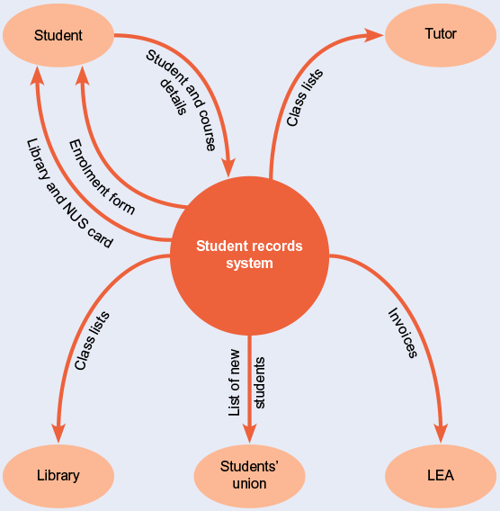
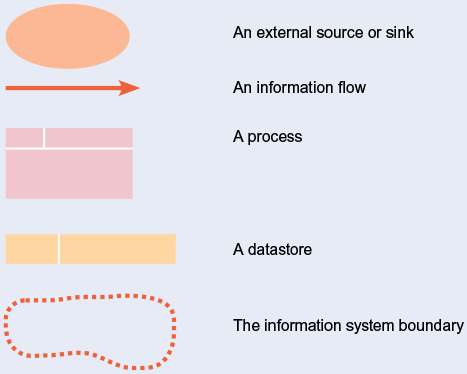
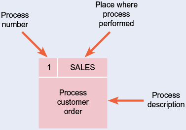

# System Analysis part-2
 

## <u>Data Modeling Diagrams</u>
 

### **Entity Relationship Diagram(ERD)**

Provide a data-focused view of the main data objects or entities within a system such as a person, place or object and the relationships between them. It is a high-level view and does not consider the detailed attributes or characteristics of an object such as a person’s name or address.

**Steps for Developing an ERD**

- <i>Identify Entities</i>  
An Entity is an object such as a person, place, thing or event about which we need to capture and store data. An entity forms a dataset about a particular object.
- <i>Workout Relationships</i>  

- <i>Identify Attributes</i>  
Inclues details related to the entitiy aka its attributes.
- <i>Identify Cardinality</i>  
- <i>Identify KEY attributes</i>  
what can't be used as KEY. it has to be unique (student id)
- <i>Resolve Assumptions</i>  
specify what the assumptions are

**Design Guidelines**

- Best practicies rather than rules
- Entities should have many occurances
- Avoid unnecessary attributes
- Clearly label all the components
- Apply correct Cardinality
- Break attributies into lowest level needed
- Labels should reflect common business terms
- Assumptions should be clearly stated

### **Balancing ERDs with DFDs**
DFDs stand for DataFlow Diagram
after gather requirements, they are fed into these diagrams

- All analysis activities are interrelated
- Process model contains two main data componenets :-  Data flows and Data stores
- The DFD data components need to balance the ERD’s data stores (entities) and data elements (attributes)
- Many CASE tools provide features to check for imbalance
- Check that all data stores and elements correspond between models

### **Information Flow Diagram (IFD)**
It is a simple diagram showing how information is routed between different parts of an organisation. It has an information focus rather than a process focus.

**Its purpose**
- to document the main flows of information around the organisation
- for analyst to check and that they have understood the flows and they have not been omitted
- the analyst may use them during the fact-finding process itself as an accurate and efficient way to document findings as they are identified;

### **Context Diagrams**
A simplified diagram that is useful for specifying the boundries and scope of the system. They can be readily produced after the IFD since they are a simplified version of it showing the external entities.

The main elements of a context diagrams are :
- a circle representing the system to be investigated
- ellipses (or boxes) representing external entities
- information flows

 
 
### **DataFlow Diagrams (DFD)**

Define the different processes in a system and the information that forms the input and output of the processes. They may be drawn at different levels. Level 0 provides an overview of the system with levels 1 and 2 providing progressively more detail.

**Explaination of symbols**

 
 

<u>*Sources*</u> - An information source is one which provides data for the process and is outside of the system boundry.  
<u>*Sinks*</u> - It is the reciever of the information and it lies outside the system boundries.  
<u>*Process*</u> - They convert data into useful information or into a different form for the purpose of extracting information from them.

 
 

<u>*DataFlows*</u> - It describes the information and data flow between different elements
<u>*DataStore*</u> - It can either prove as input for a process or it recieves data that has been output from a process.
<u>*System Boundry*</u> - It indicates what lies inside the system consideration and what lies outside of it.

**Best Practices**
- Data do not flow directly between processes, the data that enters must come from either source or datastore