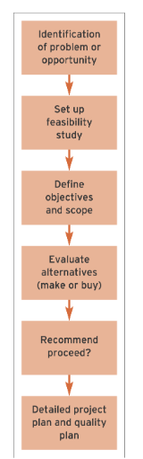

> ## **Initiation and Feasibility**

### *Initiation*
- First phase of an IS Development Project.
- Establish whether the project is feasible
- prepare to ensure that the project is sucessful

### *Feasibility*
- The activity at the start of the project to see if the project is a viable business proposition.
- The feasibility report analyses the need for and impact of the system
- Considers differnt alternatives

### *Initiation Activites 1*
|Activity|Purpose|
|----|----|
|Access Feasibilty|- performing cost-benifit analysis 
| |- Considering non-monetory considerations such as the effect new system will have on staff
| |- Comparision of different alternatives
|Define business Objectives and outline system requirements|- defining Critical Success Factors (CSF) that must be achived by incorporation of particular features|
|Evaluate acquisition alternatives|- evaluates ascepts such as cost, sustainibility, performance of systems from different suppliers, may be either bespoke or of-the-shelf
|Define scope|- specifying system boundries defining which parts of the organisation will be affected
|Define responsibilities|- responsibilities of the system developers should be specified
| |- setting aside time for input from managers and users of the system
|Assess risk|- Identify potential problems and what precautions should be taken
|Identify constraints and develop project plan| - use planning and estimating to develop a project plan allowing us to preview project size and complexity to establish a preliminary budget and timescale.

### *There are 6 benefits of IS*
- Cost reduction
- Capability 
- Communication
- Customer service
- Control
- Competitive advantage

### *The Feasibility Study*
#### - Organizational feasibility
It reviews how well the solution meets the need of the business and anticipates problems. AKA Considers the effect of the change, given a company's culture and politics.

<ins>Questions answered</ins>
Will the system meet the business’ needs and help
improve its performance?

<ins>Techniques used to control</ins>
Critical success factors and key performance indicators.
Change management.

#### - Economic feasibility
An assessment of the costs and benefits of different solutions to select which gives the best value.

<ins>Questions answered</ins>
Will the new system cost more than the expected benefits?
Will the costs outweigh the benefits?

<ins>Techniques used to control</ins>
Cost/benefit analysis. 
Return-on-investment and payback calculations.

- [x] to be continued

Cost and benifits 
  Tangible cost, intangible costs, tangible benifits, intangible benifits

IS costs 
  Hardware and software costs
  System development staff cost (especially for bespoke or tailored solutions)
  Installation cost
  Migration cost
  Operating cost (maintenance of hardware)
  Staff cost
  Training cost
  
IS benifits
  Improved accuracy
  Improved availability and timelines
  Improved usability
  Improved utilisation
  Improved security
  
Feasibility type 3
  Technical feasibility

Feasibility type 4
  Operational feasibility
  
Risk management
Risk factors
  Project size, complexity, people issue, project control, novelty, requirements stability.
 
 
8 factors in selecting a system
  Functionality
  Ease of use
  Performance
  Compatibility
  Security
  Stability/reliability
  Prospects for long term support
  Extensibility
 
 
Contracts should fulfill requirements (second last slide (before summary))

Project management
What is a project
  Set of activities which ends with specific accomplishment and which has:
    Non-routine tasks
    Distinct start/finish dates
    (Don't assume any thing)
  
  
Project Management is no small task. It has a definite beginning and the end.

Three most important factors,
  Time, cost, scope.
  Aka triple constraint
 
 
Stages:
  Project definition
    Define goals, objectives, critical success factors
  Project initiation
    Everything needed to setup the project before starting work
  Project planning 
    Detailed planned including 
  Project execution
  (To be continued)

Project team

Project planning basics
  Using action verbs
  Milestones
  Catch scheduling problems early
  Use noun verb to name eg. "Report due"
  
 
Challenge
  84% fail to hit the target budget
  45% 
  
  
5 reasons for failure

Project organization
  Project sponsor
  Project management
  
  

Project management process

Estimation

Project planning techniques

Work breakdown statement

Gantt chart

Minutes of the meeting

Task allocation

Take evaluation

Project manager

Project manager skills

Project management barriers

Successful project

