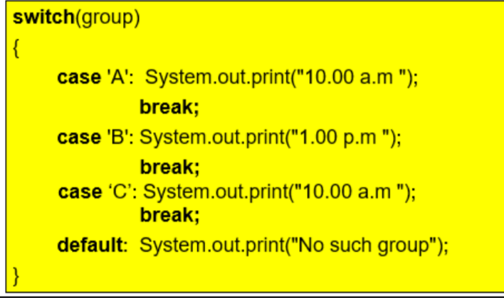

20231023Notes for CN4001.md

Topic 4
*Aims*
To look at the use of if and else statements

*Prepare*
Lecture videos, live Q&A, text chapter 3

*Lab*
Two tasks, 2 marks each. 4 marks tutorial.


**Selection in Java**

Sample program

```
import java.util.*; 
public class ShoppingApp
{
public static void main(String[] args ) 
{
double initialPrice, tax, total;
Scanner sc = new Scanner(System.in);
System.out.println("*** Product Price Check ***");
System.out.print("Enter initial price: "); 
initialPrice = sc.nextDouble(); 
System.out.print("Enter tax rate: "); 
tax = sc.nextDouble(); 
total = initialPrice * (1 + tax/100); 
System.out.println("Cost after tax = " + total); 
}
}
```
The program runs line by line. But if we want the program to have a choice, we use *if, if..else, switch* statements.

Selection is making choices between which instructions to execute.

Modifying the code so it reduces tax by 50% if the initial cost is greater than 100

```java
	    initialPrice = sc.nextDouble(); 		
        System.out.print("Enter tax rate: "); 
	    tax = sc.nextDouble();
	    if (initalPrice > 100)
	    {
	        System.out.println("Promotion: Half Tax")
	        tax = tax/2;
	    }
        total = initialPrice * (1 + tax/100); 
	    System.out.println("Cost after tax = " + total);
    }
}
```

And &&
Or ||
Not !

**Switch** statements


Example

```java
x = sc.nextln();
switch (x)
{
  case 1: case 2: System.out.println("Green");break;
  case 3: case 4:
  System.out.println("Blus"); break;
  default: System.out.println("No such group")
}
```

